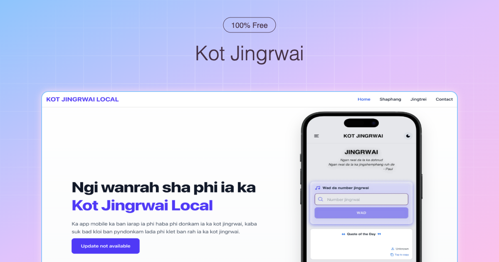
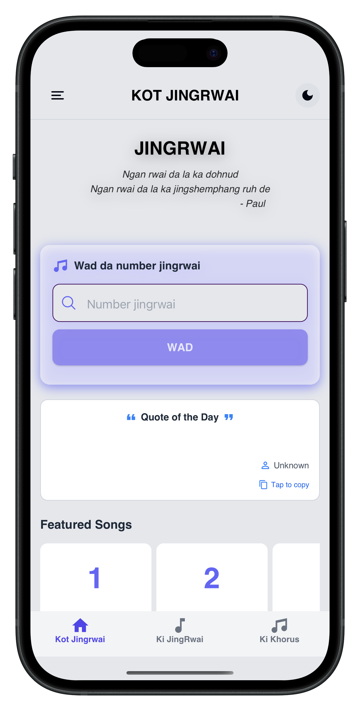

<div align="center">
  
  <h1>Kot-Jingrwai</h1>
  <p>A comprehensive platform bringing traditional Khasi hymns and songs to the digital age.</p>

  <!-- Badges -->
  <p>
    
    
    
    
    
  </p>
</div>

---

## 📖 About The Project

**Kot-Jingrwai** is an open-source initiative that digitizes and centralizes Khasi songs and choruses, making them easily accessible across web and mobile platforms. Built entirely as a modern full-stack monorepo, it empowers users with features like offline singing, synchronized lyrics, and a seamless interface.

## ✨ Key Features

- **Massive Song Library:** Access hundreds of songs and choruses natively.
- **Tynrai Jingrwai:** A dedicated section capturing authentic Khasi musical traditions.
- **Cross-Platform:** Available on the Web and Mobile (iOS & Android).
- **Offline Mode:** Enjoy lyrics anywhere, even without an internet connection.
- **Customizable Themes:** Switch themes and easily copy lyrics.
- **Improved Readability:** Optimized fonts for reading lyrics during services.

## 🛠️ Tech Stack

Kot-Jingrwai is a modern monorepo powered by **[Turborepo](https://turborepo.org/)** to ensure lightning-fast builds and easy code sharing.

- **Monorepo Management:** Turborepo, pnpm workspaces
- **Web App:** Next.js (React), Tailwind CSS
- **Mobile App:** Expo (React Native), NativeWind
- **Language:** 100% TypeScript
- **Linting & Formatting:** ESLint, Prettier

## 📂 Project Structure

```text
mono-kot-jingrwai/
├── apps/
│   ├── web/             # Next.js web application
│   └── mobile/          # React Native (Expo) mobile application
├── packages/
│   ├── ui/              # Shared React components for web
│   ├── ui-native/       # Shared React Native components
│   ├── eslint-config/   # Shared ESLint configurations
│   └── typescript-config/ # Shared tsconfig
├── package.json
└── turbo.json
```

## 🚀 Getting Started

Follow these steps to set up the project locally.

### Prerequisites

You need the following installed on your machine:
- **Node.js:** `>=18.x`
- **pnpm:** `9.0.0`

### Installation

1. **Clone the repository:**
   ```bash
   git clone https://github.com/your-username/kot-jingrwai.git
   cd kot-jingrwai
   ```

2. **Install dependencies:**
   ```bash
   pnpm install
   ```

### Running the Project

You can run individual apps or the entire monorepo using `turbo`.

- **Start all apps (Development):**
  ```bash
  pnpm dev
  ```
- **Start the Web app only:**
  ```bash
  pnpm turbo run dev --filter web
  ```
- **Start the Mobile app only:**
  ```bash
  pnpm turbo run dev --filter lynti-bneng
  ```

## 📜 Available Scripts

- `pnpm build` : Builds all applications and packages.
- `pnpm dev` : Starts local development server for all apps.
- `pnpm lint` : Lints the entire monorepo using ESLint.
- `pnpm format` : Formats all code using Prettier.
- `pnpm test` : Runs the test suite across the monorepo.
- `pnpm clean:install` : Cleans all `node_modules` and reinstalls cleanly.

## 📈 Release Notes: Version 1.0.0

**Release Date:** 2025-10-26

This major release centralizes the codebase into a monorepo for easier maintenance. All songs and choruses sync from the backend at build time. 

- **What's New:** Added the "Tynrai Jingrwai" section, introduced a new theme with text selection, added more song/chorus lyrics, and integrated everything into a Turborepo.
- **Improvements:** Corrected spelling errors, increased font size and line height for better readability, and added a developer contact feature.
- **Bug Fixes:** Resolved slow loading times and font-loading issues.

## 🤝 Contributing

Contributions are what make the open source community such an amazing place to learn, inspire, and create. Any contributions you make are **greatly appreciated**.

1. Fork the Project
2. Create your Feature Branch (`git checkout -b feature/AmazingFeature`)
3. Commit your Changes (`git commit -m 'Add some AmazingFeature'`)
4. Push to the Branch (`git push origin feature/AmazingFeature`)
5. Open a Pull Request

## 📸 Images

<div align="center">
  <!-- Add screenshots or relevant images here -->
  
</div>

## 🛡️ License

Distributed under the MIT License. See `LICENSE` for more information.

---

<p align="center">
  Built with ❤️ for the community.
</p>
